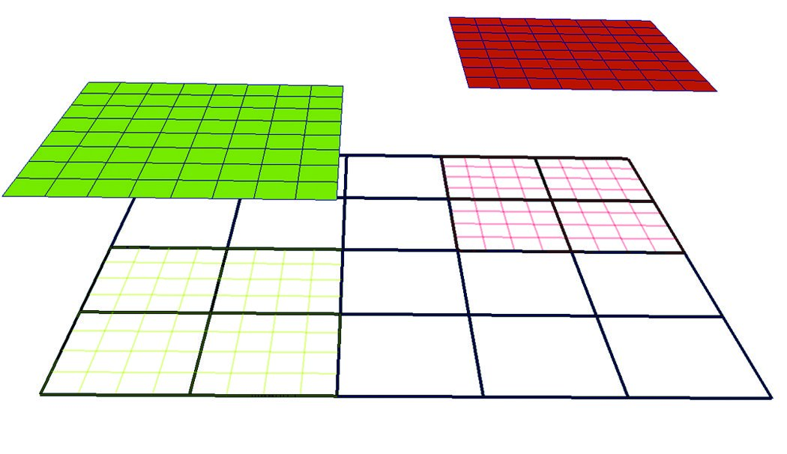
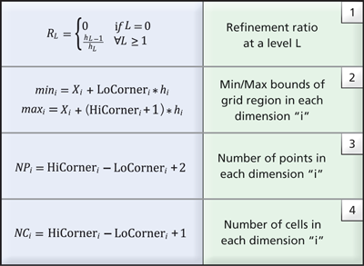

# Development Log

All the workflows here is not restricted to one type of model output. After being familiar with new ideas and new models, one can easily make use of existing samples and create reader of their own.
Because of the embarrassing parallelism nature of postprocessing, it is quite easy to take advantage of parallel approaches to process the data.

## Array Storage Ordering

I have already made a lot of mistakes by mixing the row-major and column-major codes. Explicitly list all the parts that require extra care!

## VTK

The VTK files does not have timestep information. To allow for further time series processing in Paraview, a script `create_pvd.jl` is provided for generating the `pvd` container. After dicussing with the author of [WriteVTK.jl](https://github.com/jipolanco/WriteVTK.jl), this is finally achieved by adding a scalar that is not related to grid in VTK.

Currently, multi-block (VTM), rectilinear (VTR), and unstructured (VTU) conversion are supported.
By default the file size will be reduced with compression level 6, but the actual compression ratio depends on the original data.

For the plotting, streamline tracing and particle tracing, a common problem is the grid and related interpolation process. I am envisioning a more general approach to deal with block-based and unstructured grid to provide fundamental support for all of these.

Currently, BATSRUS output contains only cell center coordinates and cell center values (referring as `tcp` in `PARAM.in`), or node coordinates and interpolated nodal values (referring as `tec`). It is recommended to save in the `tcp` format to avoid interpolation. In principle VTK also supports the combination of node coordinates and cell center values, but it is not necessary here.

The simple multiblock VTK format conversion can only deal with data within a block, but it cannot figure out the connectivities between neighboring blocks. To fill the gap between blocks, we have to retrieve the tree data stored in `.tree` files. This requires a in-depth understanding of the grid tree structure in BATSRUS, and it took me a whole week to think, write and debug the code!

Information contained in `iTree_IA`:
* the status of the node (used, unused, to be refined, to be coarsened, etc.);
* the current, the maximum allowed and minimum allowed AMR levels for this node;
* the three integer coordinates with respect to the whole grid;
* the index of the parent node (if any);
* the indexes of the children nodes (if any);
* the processor index where the block is stored for active nodes;
* the local block index for active nodes.

Basically, it requires several steps:
1. Obtain the neighbor block indexes.
2. Obtain the relative AMR level between neighbor blocks.
3. Calculate the global cell indexes.
4. Fill in the connectivity list.

Several issues worth noticing:
* The blocks are load balanced in Morton curve ordering.
* Rules are needed to decide which block is in charge of writing the connectivities. Following the `ModWriteTecplot` implementation,
  * connectivities between blocks on the same AMR level are written by the left neighbors.
  * connectivities between blocks on different AMR levels are written by the finer blocks. This choice may simplify the logic in writing.
* 2D formatted outputs (with `dxPlot⩾0`) will generate duplicate points for 2D runs after postprocessing. I don't fully understand why.
* 2D unformatted outputs (with `dxPlot<0`) can generate correct point coordinates, but the output points in postprocessing are sorted based on `x+e*y+e^2*z` to allow removing duplicate points. This is mostly useful for 2D cuts of 3D simulations where duplicate points are possible to exist, and should be merged/averaged. This also means that it is literally impossible to figure out the original cell ordering, and impossible to convert to 2D VTU format (unless you construct some new connectivities based on triangulation)! However, it guarantees that the cut outputs from parallel runs are identical.
* 3D unformatted output as stored as it is.
* The simulation is typically done with multiple MPI processes. In the tree structure, each node only records the MPI process local block index. What makes it more complicated is that the local block indexes on a given MPI process may have skipped numbers because they are not in the physical simulation domain. This means that in order to get the true global block indexes, one needs to count how many blocks are used on all MPI processes with lower ranks, and also the order of the current node based on local block index on this MPI process.
* It would be pretty difficult to count the number of elements in the connectivity list. Appending to an array is a very expensive operation: counting the elements in the first loop, preallocating the array and then repeat the same computation to fill in the list results in over 1000 times speedup.
* The implementation in v0.2.3 inherits the bug from BATSRUS `ModWriteTecplot` that will generate duplicate voxel grid. For example, imagine a coarse block which is surrounded by refined blocks all around. On edge 8, the two refined face neighbor will both think they are in charge of writing the connectivity for the cells around the edge. This does not cause any serious issues as of now, so I don't fix it. Speaking of fixing that, there are two ways:
  * `fillCellNeighbors!` not only deals with coarsened neighbors, but also the refined neighbors. This means that literally we need to implement the `message_pass_cell` completely. We still do a two-round process, write everything without checking, and in the end before IO remove the duplicate rows. This may be even faster then implementing some complicated writing rules to avoid duplicating.
  *  Polish the writing rules even further. This requires me to consider all possible cases. As a first step, for the above example case, neither of the two face neighbor should write the connectivity, but instead the edge neighbor should write.
* Many function names are inherited from BATL. I may consider rename them in the future if more general task is required.

### AMR Grid Structure

`vtkOverlappingAMR` implements a somewhat strict Berger-Collela AMR scheme:
1. All grids are Cartesian.
2. Grids at the same level do not overlap.
3. The refinement ratios, RL, between adjacent levels are integer (typically 2 or 4) and uniform within the same level.
4. Grid cells are never partially refined; i.e., each cell is refined to four quads in 2D or eight hexahedra in 3D.

Or in other words,
* Refinement ratio across levels is constant.
* Each block at levels > 0 need to be covered 100% by one parent block of
previous level.
* Some other restriction about what happens at the boundary.

You can directly use `vtkUniformGridAMR`, which does not impose any
restrictions. Most filters should work for this class - there just wouldn't
be any specialized filters such as the dual-grid contour / clip ones for
the `vtkOverlappingAMR`.

The `vtkAMRInformation` documentation consists only of
* Refinement ratio between AMR levels
* Grid spacing for each level
* The file block index for each block parent child information, if requested

Sample 2D AMR Dataset with two levels and refinement ratio, RL=4. The root level (L0) consists of a single grid shown in black wireframe while the next level (L1) consists of two grids, depicted in green wireframe and red wireframe respectively. The two grids at L1 are projected from the root level to illustrate that the cells underneath are “hidden.”

In VTK, the collection of AMR grids is stored in a `vtkHierarchicalBoxDataSet` data-structure. Each grid, G(Li,k), is represented by a `vtkUniformGrid` data structure where the unique key pair (Li,k) denotes the corresponding level (Li) and the grid index within the level (k) with respect to the underlying hierarchical structure. An array historically known as `IBLANK`, stored as a cell attribute in `vtkUniformGrid`, denotes whether a cell is hidden or not. The blanking array is subsequently used by the mapper to hide lower resolution cells accordingly when visualizing the dataset.

To enable the execution of data queries without loading the entire dataset in memory, metadata information is employed. The metadata stores a minimal set of geometric information for each grid in the AMR hierarchy. Specifically, the AMR metadata, B(Li,k), corresponding to the grid G(Li,k), is represented using a `vtkAMRBox` object and it consists of the following information:

1. N={Nx, Ny, Nz} — the cell dimensions of the grid (since the data is cell-centered)
2. The grid spacing at level L, hL={hx,hy,hz}
3. The grid level Li and grid index k
4. The global dataset origin, X=(X0, Y0, Z0), i.e., the minimum origin from all grids in level L0
5. The LoCorner and HiCorner, which describe the low and high corners of the rectangular region covered by the corresponding grid in a virtual integer lattice with the same spacing (h) that covers the entire domain.

Given the metadata information stored in the AMR box of each grid, the refinement ratio at each level can be easily computed using relationship (1) from Table 1. Further, the cartesian bounds the corresponding grid covers and the number of points and cells is also available (see relationships 2-4 in Table 1). Notably, geometric queries such as determining which cell contains a given point, or if a grid intersects a user-supplied slice plane, can be answered using just the metadata.

There is a `vtkAMRDualExtractionFilter`, which constructs a dual-mesh (i.e., the mesh constructed by connecting the cell-centers) over the computational domain.
If we can directly tell ParaView that the mesh we have is a dual-mesh, then the initial trial with multi-block data may work directly.

`AMRGaussianPulseSource`

See [Multi-Resolution Rendering with Overlapping AMR](https://www.paraview.org/ParaView/index.php/Multi-Resolution_Rendering_with_Overlapping_AMR) for the implementation of C++ reader in VTK.